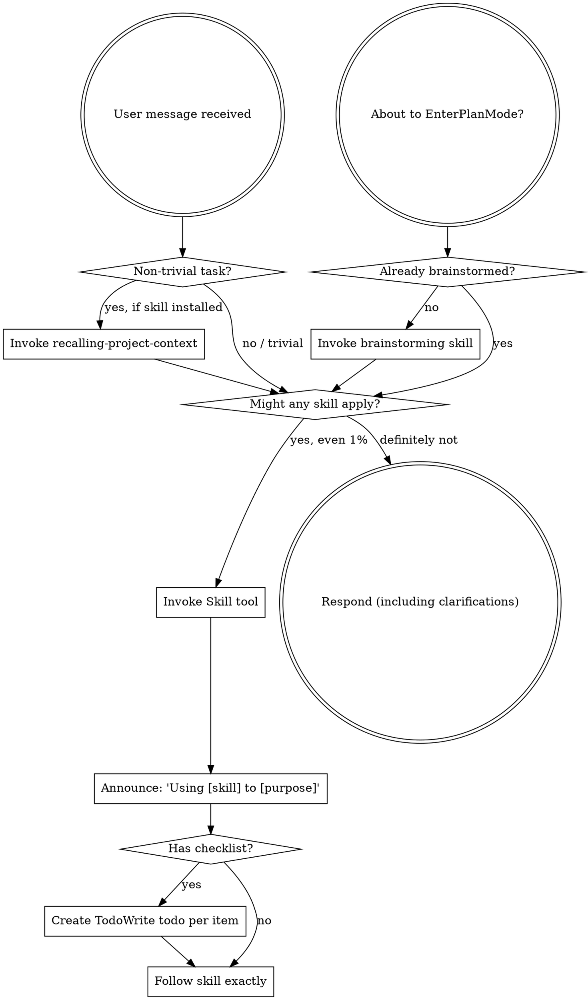

<!-- BEGIN SNOWBALL BOOTSTRAP (mirror of skills/using-snowball/SKILL.md) -->

---
name: using-snowball
description: Use when starting any conversation - establishes how to find and use skills, requiring Skill tool invocation before ANY response including clarifying questions
---

<SUBAGENT-STOP>
If you were dispatched as a subagent to execute a specific task, skip this skill.
</SUBAGENT-STOP>

<EXTREMELY-IMPORTANT>
If you think there is even a 1% chance a skill might apply to what you are doing, you ABSOLUTELY MUST invoke the skill.

IF A SKILL APPLIES TO YOUR TASK, YOU DO NOT HAVE A CHOICE. YOU MUST USE IT.

This is not negotiable. This is not optional. You cannot rationalize your way out of this.
</EXTREMELY-IMPORTANT>

## Instruction Priority

Snowball skills override default system prompt behavior, but **user instructions always take precedence**:

1. **User's explicit instructions** (CLAUDE.md, GEMINI.md, AGENTS.md, direct requests) — highest priority
2. **Project-defined skills** (anything under this repo's `skills/<name>/` that is not listed in `.gitlab/duo/snowball-skills.json`, or — in older symlink-based installs — is not a symlink into the Snowball clone) — override Snowball-shipped defaults
3. **Snowball-shipped skills** (the skills bundled with Snowball, installed into a project as copies under `skills/<name>/`) — override default system behavior
4. **Default system prompt** — lowest priority

If CLAUDE.md, GEMINI.md, or AGENTS.md says "don't use TDD" and a skill says "always use TDD," follow the user's instructions. The user is in control.

If a project defines its own `skills/<name>/SKILL.md` with the same name as a Snowball-shipped skill, prefer the project's version — it represents an intentional local override.

## How to Access Skills

**In Claude Code:** Use the `Skill` tool. When you invoke a skill, its content is loaded and presented to you—follow it directly. Never use the Read tool on skill files.

**In Copilot CLI:** Use the `skill` tool. Skills are auto-discovered from installed plugins. The `skill` tool works the same as Claude Code's `Skill` tool.

**In Aider:** Use the `/read` command to load a skill file (e.g., `/read skills/using-snowball/SKILL.md`). Aider will then follow the instructions in the file.

**In Gemini CLI:** Skills activate via the `activate_skill` tool. Gemini loads skill metadata at session start and activates the full content on demand.

**In VTCode:** Skills auto-load from `.agents/skills/<name>/SKILL.md` (project) or `~/.agents/skills/<name>/SKILL.md` (user); reference a skill by name in your prompt and VTCode activates it. Project guidelines come from `<project>/AGENTS.md` or `<project>/.vtcode/AGENTS.md`.

**In other environments:** Check your platform's documentation for how skills are loaded.

## Platform Adaptation

Skills use Claude Code tool names. Non-CC platforms: see `references/copilot-tools.md` (Copilot CLI), `references/codex-tools.md` (Codex), `references/junie-tools.md` (Junie), `references/vtcode-tools.md` (VTCode), `references/aider-tools.md` (Aider) for tool equivalents. Gemini CLI users get the tool mapping loaded automatically via GEMINI.md.

# Using Skills

## The Rule

**Invoke relevant or requested skills BEFORE any response or action.** Even a 1% chance a skill might apply means that you should invoke the skill to check. If an invoked skill turns out to be wrong for the situation, you don't need to use it.



**Cycle-start recall:** For non-trivial work, invoke `recalling-project-context` before other skills — it opens the current cycle by recovering rationale distilled from prior cycles. The session-start hook already injected a passive tier-0 excerpt; tier-1 adds live MCP recall, scoped MADRs, and staleness.

## Red Flags

These thoughts mean STOP—you're rationalizing:

| Thought | Reality |
|---------|---------|
| "This is just a simple question" | Questions are tasks. Check for skills. |
| "I need more context first" | Skill check comes BEFORE clarifying questions. |
| "Let me explore the codebase first" | Skills tell you HOW to explore. Check first. |
| "I can check git/files quickly" | Files lack conversation context. Check for skills. |
| "Let me gather information first" | Skills tell you HOW to gather information. |
| "This doesn't need a formal skill" | If a skill exists, use it. |
| "I remember this skill" | Skills evolve. Read current version. |
| "This doesn't count as a task" | Action = task. Check for skills. |
| "The skill is overkill" | Simple things become complex. Use it. |
| "I'll just do this one thing first" | Check BEFORE doing anything. |
| "This feels productive" | Undisciplined action wastes time. Skills prevent this. |
| "I know what that means" | Knowing the concept ≠ using the skill. Invoke it. |

## Skill Priority

When multiple skills could apply, use this order:

1. **Process skills first** (brainstorming, debugging) - these determine HOW to approach the task
2. **Implementation skills second** (frontend-design, mcp-builder) - these guide execution

"Let's build X" → brainstorming first, then implementation skills.
"Fix this bug" → debugging first, then domain-specific skills.

## Skill Types

**Rigid** (TDD, debugging): Follow exactly. Don't adapt away discipline.

**Flexible** (patterns): Adapt principles to context.

The skill itself tells you which.

## User Instructions

Instructions say WHAT, not HOW. "Add X" or "Fix Y" doesn't mean skip workflows.

## Skill Index

The following skills are available in this VTCode adapter. Reference a skill by name when a task fits (VTCode auto-loads matching skills from `.agents/skills/<name>/SKILL.md`):

- `blast-radius` — composite change-scope / failure-impact / action-risk analysis at lifecycle gates.
- `brainstorming` — gated design exploration. Use before any creative work.
- `writing-plans` — produces an implementation plan before code is written.
- `executing-plans` — runs an existing plan with review checkpoints.
- `test-driven-development` — red/green/refactor enforcement.
- `systematic-debugging` — root-cause-first debugging.
- `verification-before-completion` — show verification output before claiming success.
- `finishing-a-development-branch` — structured merge / PR / cleanup.
- `measuring-skill-performance` — ranks snowball skills as port candidates by token cost and reliability.
- `requesting-code-review` — produces review-ready output.
- `receiving-code-review` — responds to feedback with technical rigor.
- `subagent-driven-development` — orchestrates implementation across subagents.
- `dispatching-parallel-agents` — splits independent tasks across parallel agents.
- `decision-logging` — REFERENCE ONLY (the hooks in `.vtcode/hooks.toml` do the work; the agent does not invoke this skill).
- `syncing-decisions-to-memory` — distills the decision logs into a project ADR.
- `recalling-project-context` — cycle-start recall of prior rationale.
- `structured-argumentation` — argdown as an intermediate representation.
- `using-git-worktrees` — isolated workspace for feature work.
- `writing-skills` — meta-skill for creating new skills.
- `using-snowball` — this skill.

<!-- END SNOWBALL BOOTSTRAP -->

---

## VTCode install + usage

This file is the VTCode-side mirror of `skills/using-snowball/SKILL.md`. VTCode
injects it as project guidelines, which is how the bootstrap reaches the agent
without a `session-start` hook.

### Tool mapping

Skills use Claude Code tool names. The canonical translation table for VTCode
lives at `skills/using-snowball/references/vtcode-tools.md` in the Snowball
clone. The short version:

- `Read` / `Write` / `Edit` → `unified_file` (or `apply_patch` for edits)
- `Bash` → `unified_exec`
- `Grep` / `Glob` → `unified_search`
- `WebSearch` / `WebFetch` → `web_fetch`
- `AskUserQuestion` → `request_user_input`
- `TodoWrite` → `task_tracker`
- `EnterPlanMode` / `ExitPlanMode` → `start_planning` / `finish_planning`
- `Skill` tool → reference a skill by name in the prompt; VTCode activates it
- `Task` tool → no explicit equivalent; subagents are configured in `vtcode.toml`

### Install

```bash
# Clone the repo (or reuse the existing clone).
git clone https://github.com/kellenff/snowball.git ~/Projects/snowball

# Symlink the skills into VTCode's user-scope discovery path so they show up
# in every project. Use a project-scope path instead if you want Snowball to
# differ per-project.
mkdir -p ~/.agents/skills
for skill in ~/Projects/snowball/skills/*/; do
  ln -sfn "$skill" "$HOME/.agents/skills/$(basename "$skill")"
done

# Drop this bootstrap mirror into the project.
ln -sfn ~/Projects/snowball/.vtcode/AGENTS.md <project>/AGENTS.md
# (or copy the marked block into your existing AGENTS.md)

# Drop the hook config into the project too — without it, none of the
# capture hooks fire and the decision spine is silent. Then edit the file
# to substitute the absolute path to your Snowball clone (replace the
# `/absolute/path/to/snowball` placeholder).
ln -sfn ~/Projects/snowball/.vtcode/hooks.toml <project>/.vtcode/hooks.toml
```

Verify with `vtcode skills list` — all 18 skills should appear.

### Decision spine

VTCode fires the same Claude-Code-shaped hook rail (UserPromptSubmit,
PostToolUse, SessionStart, Stop, PreCompact) that Claude Code, Cursor, and
OpenCode already use. The hook config at `.vtcode/hooks.toml` runs these
capture paths automatically:

- **Approval-phrase MADR** (`on-user-prompt.sh` on UserPromptSubmit) — when
  the operator submits an approval phrase (`lgtm`, `looks good`, `ship it`,
  `approved`, `go ahead`, `merge it`, `do it`, etc.) and you act on it,
  the hook writes a MADR with `capture_mechanism: user-prompt-pattern`. You
  do not call this yourself.
- **Multi-choice MADR** (`on-ask-user-question-vtcode.sh` on PostToolUse
  with matcher `request_user_input`) — when you ask the user a multi-choice
  question via `request_user_input` and they answer, the hook writes one
  MADR per question-answer pair with `capture_mechanism: ask-user-question`.
  You do not call this yourself.
- **Stop extraction** (`on-stop.sh` on Stop, `on-pre-compact.sh` on
  PreCompact) — both events fork the extraction worker as a detached
  subprocess. The worker reads the session transcript, derives non-obvious
  observations, and appends them to `docs/snowball/decisions/observations.jsonl`.
- **Blast-radius audits** (`blast-radius-audit.sh` on UserPromptSubmit and
  Stop) — operator-approval audit on each approval phrase, stop-time
  change-scope audit on each assistant turn. Same scripts Claude Code and
  OpenCode use.

The capture pipeline is the standard Snowball decision spine — output lands
in `docs/snowball/decisions/` in the same MADR/observation format every
other harness uses, so downstream tooling (`syncing-decisions-to-memory`,
`recalling-project-context`) stays harness-agnostic.
