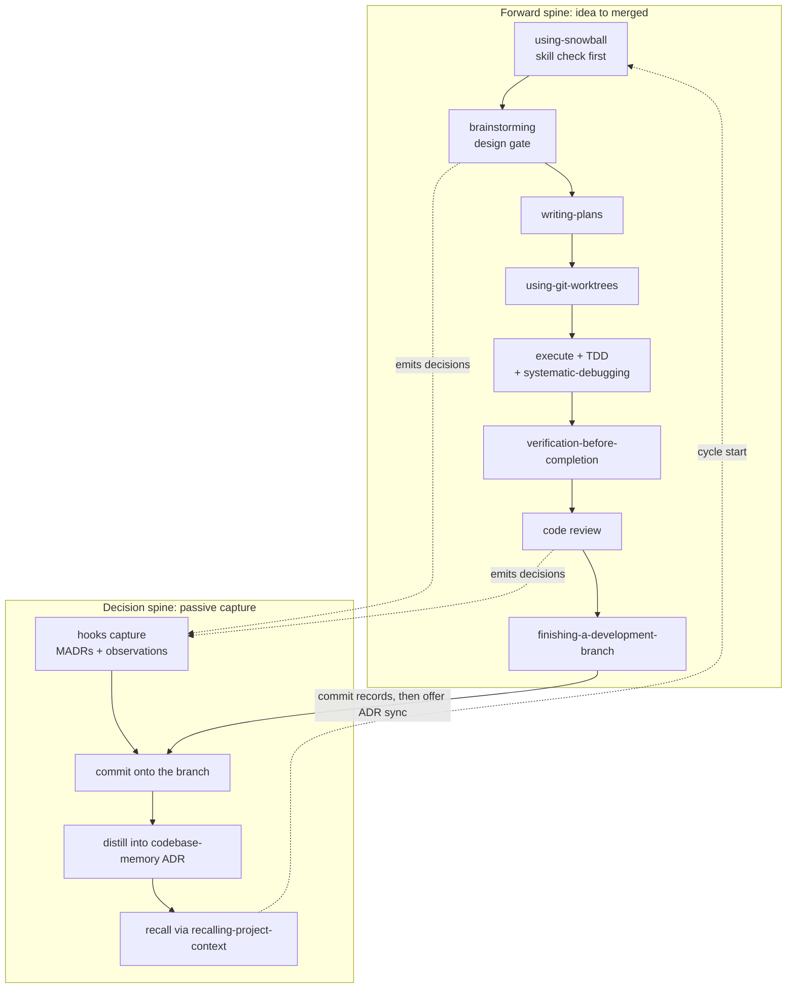

<p align="center">
  <a href="LICENSE"></a>
  <a href="https://github.com/obra/superpowers"></a>
</p>

# Snowball: agentic skills that remember why

> A personal fork of [obra/superpowers](https://github.com/obra/superpowers). It loads as agent behavior across seven AI coding harnesses, and it captures the rationale behind each decision so the next session can read it back.

> [!NOTE]
> Personal fork, maintained for my own use. Upstream is [obra/superpowers](https://github.com/obra/superpowers): the canonical project, its marketplace, and its community live there.

> [!IMPORTANT]
> Not accepting contributions. Issues and pull requests on this repository will not be reviewed.

## Why this exists

An agent makes a hundred small decisions while it builds something. Three weeks later, nobody remembers why. Snowball records those decisions as they happen and feeds them back to the next session, so the reasoning behind the code is still there when you need it.

Upstream superpowers gives a coding agent a development methodology: brainstorm before coding, plan before editing, verify before claiming done. Snowball keeps all of that and adds a second layer. A passive decision trail records what was decided and why. The result is a skills library with a memory.

## How it works: two spines

Snowball is two interlocking processes.

The **forward spine** is a chain of gates that carries work from idea to merged code. Each gate refuses to advance until its precondition is met, so the agent cannot run ahead of its own justification.

The **decision spine** runs underneath, passively. Hooks watch the events the skills already emit and record each decision, with no skill modified and nobody having to remember to log. At completion the records are committed onto the same branch as the code, distilled into a codebase-memory project ADR (plus a local disk cache), and **recalled at cycle start** via a session-start excerpt and `recalling-project-context`.



The full write-up of the two spines lives in [docs/design/snowball-process.md](docs/design/snowball-process.md).

## See it on this repo

Snowball captured the decision trail behind its own development. You can read the evidence instead of taking the claim on faith:

- [`docs/snowball/decisions/`](docs/snowball/decisions/): operator decisions as MADR markdown, plus `observations.jsonl` for lower-confidence agent observations. Every `AskUserQuestion` answer and approval phrase in a snowball session lands here.
- [`docs/design/snowball-process.md`](docs/design/snowball-process.md): the two-spine model written out, with the diagram above.
- [`docs/design/snowball-process-steelman.argdown`](docs/design/snowball-process-steelman.argdown): a steelman of the process as an argdown graph, checked with the Dung grounded-extension tool. Six arguments survive, five objections are defeated, zero remain undecided.

The decision trail behind Snowball was captured by Snowball.

## What is different from upstream

The fork is at **v5.4.0**. It began as a near-mirror of `superpowers` v5.1.0 and has since diverged along one axis: decision intelligence. These additions are fork-original and are not in upstream.

| Version | Fork-original addition                                                                                                                                                                                                                                                                                                                                                                                                                                                                                                                                                                                                                                        |
| ------- | ------------------------------------------------------------------------------------------------------------------------------------------------------------------------------------------------------------------------------------------------------------------------------------------------------------------------------------------------------------------------------------------------------------------------------------------------------------------------------------------------------------------------------------------------------------------------------------------------------------------------------------------------------------- |
| v5.2.0  | `structured-argumentation`: argdown as an intermediate representation, with a bundled parser-validator                                                                                                                                                                                                                                                                                                                                                                                                                                                                                                                                                        |
| v5.3.0  | M2 brain-jam companion: an optional second-model (MiniMax) brainstorming partner                                                                                                                                                                                                                                                                                                                                                                                                                                                                                                                                                                              |
| v5.4.0  | `decision-logging` (hook-driven capture) and `syncing-decisions-to-memory` (ADR distillation)                                                                                                                                                                                                                                                                                                                                                                                                                                                                                                                                                                 |
| v6.1.0  | `recalling-project-context` — cycle-start recall loop (tier-0 hook + tier-1 skill, staleness in `prepare`, sync disk cache); completion-flow decision trail in `finishing-a-development-branch`                                                                                                                                                                                                                                                                                                                                                                                                                                                               |
| v6.2.0  | chorus companion: brainstorming delegates to `chorus:chorus` for multi-model debate (replacing M2 brain-jam)                                                                                                                                                                                                                                                                                                                                                                                                                                                                                                                                                  |
| v6.3.0  | Junie (JetBrains IDE plugin) support: forward spine via skills + AGENTS.md; decision spine via `snowball-capture` MCP server (partial — Junie has no hook rail). Junie CLI discoverability: `.junie-extension/marketplace.json` lets Junie CLI users `/extensions marketplace add https://github.com/kellenff/snowball` and install via `/extensions install snowball`. Runtime path resolution: `run.cjs` wrapper around `snowball-capture` resolves the server's path at start time, replacing the `<absolute-path-to-snowball>` placeholder; `install-path-fix.cjs` is an optional cross-platform rewriter for adapters that don't resolve relative paths. |
| v6.6.0  | VTCode harness adapter: forward spine via `.vtcode/AGENTS.md` bootstrap mirror + `skills/using-snowball/references/vtcode-tools.md` tool mapping; skills are symlinked into VTCode's `.agents/skills/` discovery path. Decision spine via `.vtcode/hooks.toml` (UserPromptSubmit, PostToolUse on `request_user_input`, SessionStart, Stop, PreCompact) — same hook rail Claude Code, Cursor, and OpenCode use.                                                                                                                                                                                                                                                |

Everything else tracks upstream closely. Skill content, the bootstrap design, and the multi-harness adapter pattern all originate there.

## Scope and status

### What this is

- A markdown skills library that loads as agent behavior via session-start context injection.
- A multi-harness plugin: one `skills/` directory, six per-harness manifests, one shared bootstrap script that adapts its output to each harness.
- Zero `npm install` for consumers. Skills are plain markdown and the bootstrap is one bash file. Five skills ship local Node scripts with their dependencies pre-bundled into the committed `.cjs` files: `brainstorming` (a stdlib-only visual-companion server), `decision-logging` (hook bridges), `structured-argumentation` (an argdown validator), `syncing-decisions-to-memory` (ADR prepare and render), and `recalling-project-context` (recall prepare and session-start excerpt). Node runs those five; `npm install` is still not required.

### What this is not

- Not an MCP server, not a runtime tool, not a library you import.
- Not on any plugin marketplace. Install is clone-and-link only.
- Not accepting issues, PRs, or feature requests.

### Known stale or broken

These are real artifacts that have not been reconciled with the fork's posture. They are tracked here so a future debug session does not waste time:

- **Install instructions inherited from upstream do not work.** The bulk rename pointed old documentation text at `kellenff/snowball-marketplace`, which does not exist. The Setup section below is the real install path.
- **`scripts/sync-to-codex-plugin.sh` targets the wrong destination.** Its `FORK=` constant still points at upstream's Codex distribution repo, so the script will fail or push to a repo I do not own. Codex support stays; only the sync path is broken.
- **`CLAUDE.md` is absent.** This fork has no Claude-Code-specific context file yet. `AGENTS.md` covers the other harnesses and is freshly written for the fork; a Claude-Code file may follow.
- **`.github/ISSUE_TEMPLATE/`** carries upstream's open-issues assumption, which does not fit a fork that takes no issues.

## Skills index

18 skills in five groups. Each links to its `SKILL.md`.

### Bootstrap

- [`using-snowball`](skills/using-snowball/SKILL.md): the entry-point skill, injected into every session by the bootstrap hook. It sets the "check skills before responding" discipline and the instruction priority (user > project skills > snowball skills > default system prompt).

### Process and methodology

- [`brainstorming`](skills/brainstorming/SKILL.md): gated design exploration that refuses implementation until a design is presented and approved. Ships a [visual companion](skills/brainstorming/visual-companion.md) server for diagram-driven review.
- [`writing-plans`](skills/writing-plans/SKILL.md): produces an implementation plan before code is written.
- [`executing-plans`](skills/executing-plans/SKILL.md): runs an existing plan with review checkpoints.
- [`test-driven-development`](skills/test-driven-development/SKILL.md): red/green/refactor enforcement.
- [`systematic-debugging`](skills/systematic-debugging/SKILL.md): root-cause-first debugging.
- [`verification-before-completion`](skills/verification-before-completion/SKILL.md): run the verification commands and show the output before claiming success.
- [`finishing-a-development-branch`](skills/finishing-a-development-branch/SKILL.md): structured merge, PR, or cleanup at the end of work; commits the decision trail on preserve paths.

### Collaboration

- [`requesting-code-review`](skills/requesting-code-review/SKILL.md): produces review-ready output.
- [`receiving-code-review`](skills/receiving-code-review/SKILL.md): responds to feedback with technical rigor, not performative agreement.
- [`subagent-driven-development`](skills/subagent-driven-development/SKILL.md): orchestrates implementation across subagents.
- [`dispatching-parallel-agents`](skills/dispatching-parallel-agents/SKILL.md): splits independent tasks across parallel agents.

### Decision intelligence

- [`decision-logging`](skills/decision-logging/SKILL.md): reference documentation for the hook-driven capture system. Four Claude Code hooks emit operator MADRs and agent observations; the agent does not invoke this skill, the hooks do the work.
- [`syncing-decisions-to-memory`](skills/syncing-decisions-to-memory/SKILL.md): distills the decision logs into a codebase-memory project ADR via the `manage_adr` MCP tool. It owns the TRADEOFFS and PHILOSOPHY sections and is idempotent.
- [`recalling-project-context`](skills/recalling-project-context/SKILL.md): **cycle-start recall** — tier-0 session hook excerpt plus tier-1 active gate before non-trivial work (live MCP, scoped MADRs, staleness). Closes the capture → commit → distill → recall loop.
- [`structured-argumentation`](skills/structured-argumentation/SKILL.md): argdown as an intermediate representation for the structure of an argument (option comparison, hypothesis elimination, claim decomposition). Ships a parser-only validator bundled from `@argdown/core`.

### Infrastructure

- [`using-git-worktrees`](skills/using-git-worktrees/SKILL.md): sets up an isolated workspace for feature work.
- [`writing-skills`](skills/writing-skills/SKILL.md): the meta-skill for creating and adversarially testing new skills.

## The decision spine in detail

Capture is passive. No skill is modified, and the operator never has to remember to log. The brainstorming, planning, and review skills generate the events; the hooks observe them.

| Hook                             | Trigger                             | Produces                                                                                      |
| -------------------------------- | ----------------------------------- | --------------------------------------------------------------------------------------------- |
| PostToolUse on `AskUserQuestion` | Operator picks an option            | One MADR per question-answer pair                                                             |
| UserPromptSubmit (pattern match) | Operator submits an approval phrase | One MADR, deduped against recent captures                                                     |
| Stop, detached worker            | Session ends                        | Headless `claude -p` extracts observations from the transcript tail into `observations.jsonl` |
| PreCompact, detached worker      | Auto-compaction is imminent         | The same worker, run before the context window is summarized                                  |

All hooks no-op silently outside a git repo. `Stop` and `PreCompact` coordinate through a per-session cursor and a non-blocking `flock`, so each transcript region is fed to `claude -p` exactly once. Even a long session abandoned after compacting still emits its pre-compaction observations.

Capture hooks are registered for Claude Code and Cursor. Claude uses `AskUserQuestion`; Cursor uses `AskQuestion`. Other harnesses run the forward spine without the decision trail.

At completion, `finishing-a-development-branch` commits the records under `docs/snowball/decisions/` onto the same branch as the work, then offers to run `syncing-decisions-to-memory`. That step is self-gating: if codebase-memory is unreachable or the repo is not indexed, it stops cleanly, so completion never breaks on a missing dependency.

At the next session, the bootstrap hook injects a capped ADR excerpt from `.codebase-memory/adr.md` when present (written by `syncing-decisions-to-memory` after ADR sync). For live recall and scoped decision logs at cycle start, invoke `recalling-project-context` before non-trivial design work — it falls back to on-disk MADRs when MCP is absent.

## Per-harness adapters

| Harness                     | Manifest                                                                              | Bootstrap loader                                                                                                                                                       | Context file                          |
| --------------------------- | ------------------------------------------------------------------------------------- | ---------------------------------------------------------------------------------------------------------------------------------------------------------------------- | ------------------------------------- |
| Claude Code                 | `.claude-plugin/plugin.json`                                                          | `hooks/hooks.json` to `hooks/run-hook.cmd session-start`                                                                                                               | none yet (bootstrap injects via hook) |
| Cursor                      | `.cursor-plugin/plugin.json`                                                          | `hooks/hooks-cursor.json` to the same script                                                                                                                           | `AGENTS.md`                           |
| GitHub Copilot CLI          | `.claude-plugin/plugin.json` (shared)                                                 | same script; detects `COPILOT_CLI=1` and emits SDK-standard JSON                                                                                                       | `AGENTS.md`                           |
| OpenCode                    | `.opencode/plugins/snowball.js`                                                       | JS plugin, `experimental.chat.messages.transform` hook                                                                                                                 | `AGENTS.md`                           |
| Codex CLI / Codex App       | `.codex-plugin/plugin.json`                                                           | distributed via `scripts/sync-to-codex-plugin.sh` (currently stale)                                                                                                    | `AGENTS.md`                           |
| Gemini CLI                  | `gemini-extension.json`                                                               | extension-managed; skills activate via `activate_skill`                                                                                                                | `GEMINI.md`                           |
| GitLab Duo                  | `.gitlab/duo/hooks.json` (CLI only)                                                   | `hooks.json` to `run-hook.cmd session-start`; detects `DUO_SESSION_ID`                                                                                                 | `AGENTS.md`                           |
| Aider                       | `.aider.conf.yml`                                                                     | `read` entry in config                                                                                                                                                 | `AGENTS.md`                           |
| Junie (JetBrains IDE + CLI) | `extensions/snowball/extension.json` + `.junie-extension/marketplace.json` (CLI only) | bundled `snowball-capture` MCP server + `.junie/AGENTS.md` for context; CLI users register the repo as a custom Junie marketplace                                      | `AGENTS.md`                           |
| VTCode                      | `.vtcode/AGENTS.md` (bootstrap mirror)                                                | project guidelines via `AGENTS.md`; skills symlinked into `.agents/skills/`; unified_search auto-approved via prefix cache; apply_patch observation+blast-radius hooks | `AGENTS.md`                           |

### How the bootstrap works

The whole plugin hinges on `skills/using-snowball/SKILL.md` being injected into the agent's context at session start, not just present on disk. Without injection, the agent never invokes the `Skill` tool and the rest of the library is dead weight.

For shell-driven harnesses, [`hooks/session-start`](hooks/session-start) reads `using-snowball/SKILL.md`, JSON-escapes it with bash parameter substitution (no `jq` dependency), wraps it in `<EXTREMELY_IMPORTANT>` framing, and branches on environment variables:

- `CURSOR_PLUGIN_ROOT` set: `additional_context` (snake_case).
- `CLAUDE_PLUGIN_ROOT` set without `COPILOT_CLI`: `hookSpecificOutput.additionalContext`.
- `DUO_SESSION_ID` set: `hookSpecificOutput.additionalContext` (GitLab Duo CLI, same shape as Claude Code).
- Otherwise: `additionalContext` (Copilot CLI and SDK standard).

[`hooks/run-hook.cmd`](hooks/run-hook.cmd) is a polyglot file. Line 1 (`: << 'CMDBLOCK'`) is a no-op heredoc in bash, which lets Windows batch syntax live in the same file. On Windows, `cmd.exe` ignores the bash framing and locates `bash.exe`; on Unix, bash skips the batch block and execs the named script.

OpenCode cannot shell out reliably, so [`.opencode/plugins/snowball.js`](.opencode/plugins/snowball.js) does the same job in JS: it reads the SKILL.md, strips frontmatter inline, caches the result, and injects the bootstrap as the first text part of the first user message. A guard prevents double-injection when OpenCode re-runs the transform per agent step.

## Setup

This repo installs by clone-and-link, not marketplace distribution.

### Quick install (curl-pipe)

If you'd rather skip the clone step, the bootstrap installer can be piped straight from the repo's raw branch:

```bash
curl -fsSL https://raw.githubusercontent.com/kellenff/snowball/main/scripts/install.sh | bash -s -- vtcode --target /path/to/your/project
```

Read it first if you're cautious about piping curl to bash:

```bash
curl -fsSL https://raw.githubusercontent.com/kellenff/snowball/main/scripts/install.sh | less
```

Pass arguments after `--`:

```bash
# Pick a provider and a target project in one shot
curl -fsSL https://raw.githubusercontent.com/kellenff/snowball/main/scripts/install.sh \
  | bash -s -- --provider vtcode --target /path/to/your/project

# Pull the latest Snowball and refresh a project
curl -fsSL https://raw.githubusercontent.com/kellenff/snowball/main/scripts/install.sh \
  | bash -s -- --provider vtcode --target /path/to/your/project --update
```

`--provider` accepts any of the names listed at the top of `scripts/install.sh --help` (`claude-code`, `vtcode`, `duo`, `aider`, `opencode`, `cursor`, `codex`, `gemini`, `copilot`, `junie`, `junie-cli`). The default provider when piped from curl is `vtcode`, since it's the only one whose install is fully shell-scriptable end-to-end; the others print the exact commands and stop.

### Manual install (clone-and-link)

```bash
git clone https://github.com/kellenff/snowball.git ~/Projects/snowball
```

Then install into each harness:

- **Claude Code**: register the repo as a local marketplace with `/plugin marketplace add /path/to/snowball`, install with `/plugin install snowball@snowball-dev` (the marketplace name is set in [`.claude-plugin/marketplace.json`](.claude-plugin/marketplace.json)), then run `/reload-plugins`. The hook in [`hooks/hooks.json`](hooks/hooks.json) fires at every `SessionStart`, `/clear`, and `/compact`.
- **OpenCode**: see [`docs/README.opencode.md`](docs/README.opencode.md). The plugin auto-registers its skills path; no manual symlink is needed.
- **Cursor, Codex, Gemini CLI, Copilot CLI**: follow each harness's plugin documentation, pointing at this repo's matching manifest.
- **GitLab Duo**: see [`docs/README.gitlab-duo.md`](docs/README.gitlab-duo.md). Short version: from inside a target project, run [`scripts/install-into-project.sh`](scripts/install-into-project.sh) from this clone. It writes per-skill files under `skills/<name>/`, symlinks `AGENTS.md`, and generates `.gitlab/duo/hooks.json` with the absolute Snowball path patched in. Duo CLI users launch with `--enable-project-hooks` so the SessionStart hook fires.
- **Aider**: from inside a target project, run [`scripts/install-into-project.sh`](scripts/install-into-project.sh) from this clone. It copies skills into `skills/` and ensures `.aider.conf.yml` includes `read: [AGENTS.md]`.
- **Junie (JetBrains IDE plugin)**: in the IDE, install the local extension pointing at `extensions/snowball/` in this clone. The `mcp/mcp.json` points at `../snowball-capture/run.cjs` which resolves the server's path at start time, so no manual edit is needed for `snowball-capture`. The `argdown`, `codebase-memory`, and `yactt` entries are external user-installed MCP servers and still need their `<absolute-path-to-*>` placeholders replaced with real absolute paths. Restart the IDE so Junie picks up the wiring. The `.junie/AGENTS.md` is read automatically as project guidelines.
- **Junie CLI**: in any project, in a Junie CLI session, run `/extensions marketplace add https://github.com/kellenff/snowball` and then `/extensions install snowball`. The extension content is cached under `~/.junie/extensions/`; no project files are modified. After install, the `snowball-capture`, `argdown`, `codebase-memory`, and `yactt` MCP servers should appear as `Active` in `/mcp`. The bundled `mcp/mcp.json` uses a relative path to `run.cjs` which resolves the server's path at start time; for adapters that don't resolve relative paths, run `node extensions/snowball/scripts/install-path-fix.cjs` once after install.
- **yactt** (required for `blast-radius` graph backend): install [yactt](https://github.com/kellenff/yactt) before running snowball on a real repo. The snowbld `blast-radius` skill shells out to a Deno shim at `extensions/snowball/yactt-cli/cli.ts` which talks to `yactt mcp serve`. Deno 2.7+ is required. See [`docs/snowball/specs/2026-07-10-yactt-graph-backend-design.md`](docs/snowball/specs/2026-07-10-yactt-graph-backend-design.md) for the rollout plan.
- **VTCode**: run `bash scripts/install.sh vtcode --target <your-project>` from inside the Snowball clone (the curl-pipe form is in the Quick install block above). The install script symlinks the skills into `~/.agents/skills/`, links the bootstrap mirror as `<your-project>/AGENTS.md`, and writes both `hooks.toml` and `cron-madr-digest.json` into `<your-project>/.vtcode/` with the absolute path to your Snowball clone already substituted — no manual edit required. Re-run with `--force` to refresh after a pull. Manual fallback if you can't run the script: clone the repo to `~/Projects/snowball`, symlink each skill into `~/.agents/skills/`, symlink `.vtcode/AGENTS.md` as `<your-project>/AGENTS.md`, then `cp` both `.vtcode/hooks.toml` and `scripts/cron-madr-digest.json` into `<your-project>/.vtcode/` and `sed 's|/absolute/path/to/snowball|~/Projects/snowball|g'` each — but the install script is the supported path. Verify with `vtcode skills list` (all 18 skills should appear) and by answering a `request_user_input` prompt — a MADR should appear under `docs/snowball/decisions/`. The committed `.vtcode/tool-policy.json` is a user-environment artifact, not a Snowball-managed file.
- **Windows**: see [`docs/windows/`](docs/windows/). The polyglot [`hooks/run-hook.cmd`](hooks/run-hook.cmd) handles Windows as long as bash is reachable (Git for Windows, MSYS2, Cygwin, or PATH).

Update after a pull:

```bash
cd ~/Projects/snowball
git pull
# In Claude Code: /reload-plugins
```

Version bumps across the six manifests are driven by [`scripts/bump-version.sh`](scripts/bump-version.sh) reading [`.version-bump.json`](.version-bump.json).

### Maintainer setup

Snowball uses pre-commit hooks for formatting, linting, and the decision-logging build. Consumers do not need any of this; the shipped `.cjs` bundles already inline their dependencies.

```bash
# Required tools (one-time)
brew install pre-commit shellcheck shfmt markdownlint-cli2 oxlint oxfmt bun

# Local devDeps (typescript, @types, js-yaml, @argdown/core for the bun build)
npm install

# Test deps for decision-logging
(cd tests/decision-logging && npm install)

# Activate hooks, then verify the toolchain
pre-commit install
pre-commit run --all-files
```

The bundles under `skills/*/scripts/*.cjs` are built outputs. Edit the TypeScript in `skills/*/src/`, and the pre-commit hook regenerates and stages the bundles. Bun (`bun build --target=node --format=cjs`) is a maintainer dependency only.

## Repository map

| Path                                                                                       | What lives here                                                                                                                                                         |
| ------------------------------------------------------------------------------------------ | ----------------------------------------------------------------------------------------------------------------------------------------------------------------------- |
| `skills/`                                                                                  | The 20 skills (see the Skills index). Each is a directory with a `SKILL.md` plus optional `references/`, `scripts/`, and `src/`.                                        |
| `hooks/`                                                                                   | `session-start` (the bash bootstrap), `run-hook.cmd` (polyglot bash/batch wrapper), `hooks.json` (Claude Code registration), `hooks-cursor.json` (Cursor registration). |
| `.claude-plugin/`                                                                          | Claude Code plugin manifest plus the dev marketplace manifest.                                                                                                          |
| `.codex-plugin/`, `.cursor-plugin/`, `.opencode/`, `gemini-extension.json`, `.gitlab/duo/` | Per-harness manifests and plugins.                                                                                                                                      |
| `docs/design/`                                                                             | The two-spine process write-up and its argdown rationale and steelman maps.                                                                                             |
| `docs/snowball/decisions/`                                                                 | Captured decision trail: MADR markdown plus `observations.jsonl`.                                                                                                       |
| `docs/snowball/specs/`, `docs/snowball/plans/`                                             | Design specs and implementation plans.                                                                                                                                  |
| `docs/`                                                                                    | Setup notes (`README.opencode.md`, `README.gitlab-duo.md`, `windows/`) and testing notes (`testing.md`).                                                                |
| `tests/`                                                                                   | 11 test groupings: per-harness bootstrap tests, Codex-sync verification, skill-triggering evals, decision-logging and decision-sync tests, SDD end-to-end runs.         |
| `scripts/`                                                                                 | `bump-version.sh`, `install-into-project.sh`, and `sync-to-codex-plugin.sh` (currently stale).                                                                          |
| `AGENTS.md`, `GEMINI.md`                                                                   | Per-harness context files. No `CLAUDE.md` in this fork yet.                                                                                                             |
| `RELEASE-NOTES.md`                                                                         | Snowball's own release history from v5.2.0 onward.                                                                                                                      |

## Pointers

- [`docs/design/snowball-process.md`](docs/design/snowball-process.md): the two-spine methodology.
- [`docs/testing.md`](docs/testing.md): what each `tests/` grouping covers and how to run it.
- [`docs/README.opencode.md`](docs/README.opencode.md), [`docs/README.gitlab-duo.md`](docs/README.gitlab-duo.md), [`docs/windows/`](docs/windows/): harness-specific setup.
- [`AGENTS.md`](AGENTS.md), [`GEMINI.md`](GEMINI.md): per-harness context files.
- `.claude/grfp/`: the staging reports (deep-dive, crystal-ball, brain-jam, think-tank) behind this README.

## License and attribution

MIT, inherited from upstream. See [`LICENSE`](LICENSE).

Snowball is a fork of [obra/superpowers](https://github.com/obra/superpowers) by Jesse Vincent and the team at [Prime Radiant](https://primeradiant.com). All skill content, the bootstrap design, and the multi-harness adapter pattern originate there. This fork exists for personal maintenance; substantive credit belongs upstream.
