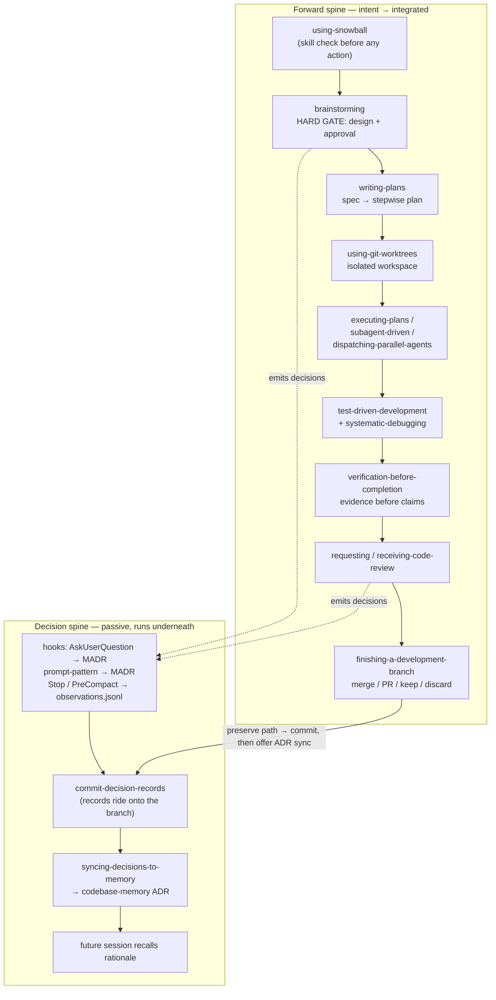

# The Snowball Process

A summary of the development *methodology* snowball encodes — the lifecycle its
skills enforce, from a raw idea to integrated, reviewed code whose rationale
survives into the next session.

> **Scope.** This document is about the **process** (what the skills make an
> agent *do*). For the **plugin mechanics** — the multi-harness bootstrap, the
> per-harness manifests, the `session-start` hook — see the
> [top-level README](../../README.md). The two meet at exactly one point: the
> bootstrap injects [`using-snowball`](../../skills/using-snowball/SKILL.md) into
> every session, which is what sets the whole process in motion.

## The shape in one sentence

Snowball is **two interlocking spines**: a *forward spine* of gates that carries
work from intent to integration, and a *decision spine* that passively captures
why each choice was made and feeds it back to future work. The forward spine is
what the agent does; the decision spine is the memory it leaves behind.

The structural argument for *why* the process is shaped this way — the gates,
the passive capture loop, and the friction/ceremony tension it deliberately
holds — is externalized as an argdown map alongside this file:
[`snowball-process.argdown`](./snowball-process.argdown) (parses clean under the
`structured-argumentation` validator).

## Forward spine — the lifecycle gates

Each stage is a gate: it refuses to advance until its precondition is met, so
work can never run ahead of its own justification.

| Stage | Skill | What it gates |
| --- | --- | --- |
| 0. Bootstrap | [`using-snowball`](../../skills/using-snowball/SKILL.md) | Injected at session start. Forces a skill check **before any response**, including clarifying questions. Sets instruction priority: user > project skills > snowball skills > system default. |
| 1. Design | [`brainstorming`](../../skills/brainstorming/SKILL.md) | **Hard gate.** No implementation skill, no code, no scaffold until a design is presented and the operator approves it. Terminal state is invoking `writing-plans` — nothing else. Output: a spec under `docs/snowball/specs/`. |
| 2. Plan | [`writing-plans`](../../skills/writing-plans/SKILL.md) | Turns the approved spec into a stepwise implementation plan before code is touched. Output: a plan under `docs/snowball/plans/`. |
| 3. Isolate | [`using-git-worktrees`](../../skills/using-git-worktrees/SKILL.md) | Feature work gets a workspace isolated from the current one (native worktree or fallback). |
| 4. Build | [`executing-plans`](../../skills/executing-plans/SKILL.md), [`subagent-driven-development`](../../skills/subagent-driven-development/SKILL.md), [`dispatching-parallel-agents`](../../skills/dispatching-parallel-agents/SKILL.md) | Runs the plan with review checkpoints — in-session via subagents, or fanned out across parallel agents for independent tasks. |
| 5. Discipline | [`test-driven-development`](../../skills/test-driven-development/SKILL.md), [`systematic-debugging`](../../skills/systematic-debugging/SKILL.md) | Red/green/refactor enforcement; root-cause-before-fix when something breaks. |
| 6. Verify | [`verification-before-completion`](../../skills/verification-before-completion/SKILL.md) | Requires running verification commands and showing the output **before** any "done / passing / fixed" claim. Evidence before assertions. |
| 7. Review | [`requesting-code-review`](../../skills/requesting-code-review/SKILL.md), [`receiving-code-review`](../../skills/receiving-code-review/SKILL.md) | Produces review-ready output; responds to feedback with technical rigor, not performative agreement. |
| 8. Finish | [`finishing-a-development-branch`](../../skills/finishing-a-development-branch/SKILL.md) | Verify tests → detect environment → present exactly 4 options (merge / PR / keep / discard) → execute → clean up worktree (provenance-checked) → offer ADR sync. |

## Decision spine — passive capture, then recall

The decisive design choice: **capture is a side-effect of working, not a task.**
None of the process skills above are modified to "remember to log." Hooks observe
the events those skills already emit. (This is documented, not invoked, by the
[`decision-logging`](../../skills/decision-logging/SKILL.md) reference skill — the
hooks do the work.)

**Capture** — two streams, four hooks:

| Hook | Trigger | Produces |
| --- | --- | --- |
| PostToolUse on `AskUserQuestion` | Operator picks an option | One MADR per Q-A pair (`capture_mechanism: ask-user-question`) |
| UserPromptSubmit (pattern match) | Operator submits an approval phrase | One MADR (`user-prompt-pattern`), deduped against recent captures |
| Stop → detached worker | Session ends | Headless `claude -p` extracts observations from the unprocessed transcript tail → `observations.jsonl` |
| PreCompact → detached worker | Auto-compaction imminent | Same worker, before the context window is summarized |

Operator decisions land as MADR markdown; agent observations land as JSONL — both
under `docs/snowball/decisions/`. `Stop` and `PreCompact` coordinate via a
per-session cursor + `flock` so each transcript region is processed exactly once.

**Commit** — at completion, `finishing-a-development-branch` runs its
`commit-decision-records` sub-step on every *preserve* path (merge / PR / keep),
committing the decision trail **onto the same branch as the work it documents**.
Discard skips it — the records are untracked and survive in the working tree
regardless. This operationalizes the standing practice: *records ride with the
work*.

**Distill** — after a preserve disposition, the finish skill offers to run
[`syncing-decisions-to-memory`](../../skills/syncing-decisions-to-memory/SKILL.md),
which distills the operator MADRs + filtered observations into codebase-memory's
project **ADR** via the `manage_adr` MCP tool. It owns the **TRADEOFFS** and
**PHILOSOPHY** sections and is idempotent — a no-change re-run is a no-op.

**Recall** — a later session queries codebase-memory and recovers the rationale
behind the code it is about to change, closing the loop.

## Cross-cutting sub-skills

These aren't lifecycle stages; they're reached *within* a stage on demand:

- [`structured-argumentation`](../../skills/structured-argumentation/SKILL.md) —
  argdown as an intermediate representation for surfacing the *structure* of
  reasoning already done in prose: option-comparison (in brainstorming),
  hypothesis-elimination (in debugging), claim-decomposition (in code review).
  Opt-in, only when branching exceeds working memory. A captured decision can
  attach its `.argdown` map via `snowball.argdown_path` (schema v1.1). This very
  document's companion map is an example.
- **M2 brain-jam** (when the `m2-brainstorm` CLI is installed) — a second-model
  (MiniMax) perspective offered once per substantive brainstorm, reached only at
  the "propose 2-3 approaches" step on genuinely cross-cutting trade-offs.
  Complementary to argdown: argdown structures *your* reasoning; the jam injects
  *another model's*.

## Steelman analysis — does the process survive its strongest objections?

The forward and decision spines are only worth defending if they hold up against
their *best* critiques, not strawmen. The dialectic below is externalized as a
sibling map,
[`snowball-process-steelman.argdown`](./snowball-process-steelman.argdown), and
run through the Dung grounded-extension tool to see which arguments survive once
every attack resolves.

| Steelmanned objection | Rebuttal that reinstates the process |
| --- | --- |
| **Ceremony tax** — the hard design gate fires on every task "regardless of perceived simplicity," taxing trivial work and training operators to rubber-stamp. | The enforced gate is just *present a design + get approval* — a few sentences for simple work; worktrees fall back to cwd, argdown/jam are opt-in, and **user instructions outrank every skill**. The floor is one sentence, and it still leaves a reviewable artifact. |
| **Process theater** — gates check a step *happened*, not that it was done *well*; the ritual can be performed without rigor. | Every gate emits an *inspectable artifact* — shown command output (not a claim), a reviewable diff, on-disk MADRs — so ritual-without-rigor is catchable in review. The floor rises; rigor isn't guaranteed. |
| **Capture noise / privacy** — an MADR per click, observations per tail, much of it low-signal; the Stop worker reads the full transcript. | Two-stream confidence separation; `syncing-decisions-to-memory` *filters* observations, owns only TRADEOFFS/PHILOSOPHY, idempotently; privacy has a review-and-gitignore escape hatch. |
| **Single-harness coupling** — the richest capture (`AskUserQuestion` MADRs) is Claude-Code-only and assumes an interactive operator. | The forward spine runs on seven harnesses; the decision spine is *additive* — its absence breaks nothing, the Stop/PreCompact worker still runs, MADRs can be hand-authored. Degrades, doesn't collapse. |
| **Infra dependence** — resumability leans on codebase-memory being indexed and reachable. | The durable source of truth is *on disk*: MADRs + `observations.jsonl` ride with the work; codebase-memory's ADR is a derived cache and the sync *self-gates*. Outage degrades recall convenience, not rationale preservation. |

**Grounded extension** (argdown `dung_extensions`, 11 arguments / 10 attacks):
all five rebuttals are unattacked and land **IN**, defeating all five objections
(**OUT**), which leaves the thesis with no surviving attacker — `Process-Holds`
is reinstated **IN**, with **zero UNDEC**.

This is reinforcement, not invulnerability. Each rebuttal raises the floor rather
than guaranteeing a ceiling, and the map records three residual concessions
(`[Phase-1-Capture]`, `[Opt-In-Hygiene]`, `[Floor-Not-Ceiling]`) as scope limits
that qualify the thesis's breadth without negating it.

## Structural facts (from codebase-memory)

The repo backing this process is, deliberately, **markdown-first**:

- Indexed as `Users-kellen-Projects-snowball`: ~2,550 nodes / ~2,820 edges, of
  which **1,396 are `Section` nodes** — the skills *are* prose, parsed as
  document sections, not code.
- Only ~154 `Function` nodes across the three skills that ship local Node
  scripts (`brainstorming` visual server, `decision-logging` hook bridges,
  `structured-argumentation` validator). Everything else is behavior expressed as
  instructions.
- The process leaves a paper trail on disk: `docs/snowball/specs/` (designs),
  `docs/snowball/plans/` (implementation plans), `docs/snowball/decisions/`
  (MADRs + `observations.jsonl`) — the durable outputs of the two spines.

## Multi-harness note

The same process runs on Claude Code, Codex CLI, Cursor, OpenCode, Gemini CLI,
Copilot CLI, and GitLab Duo — one `skills/` directory, per-harness manifests, and
a shared bootstrap that adapts its JSON to each harness. The **decision spine's
capture hooks are Claude-Code-only** for now (they depend on `AskUserQuestion`
and Claude Code hook events); the forward spine is harness-portable. See the
[README](../../README.md) for the adapter details.

## See also

- [`snowball-process.argdown`](./snowball-process.argdown) — the design-rationale
  map for this process.
- [`snowball-process-steelman.argdown`](./snowball-process-steelman.argdown) — the
  steelman dialectic (objections vs rebuttals) behind the analysis above.
- [README](../../README.md) — plugin architecture, bootstrap, per-harness adapters.
- [`docs/snowball/specs/2026-05-25-decision-logging-design.md`](../snowball/specs/2026-05-25-decision-logging-design.md)
  — full design of the decision-logging system.
