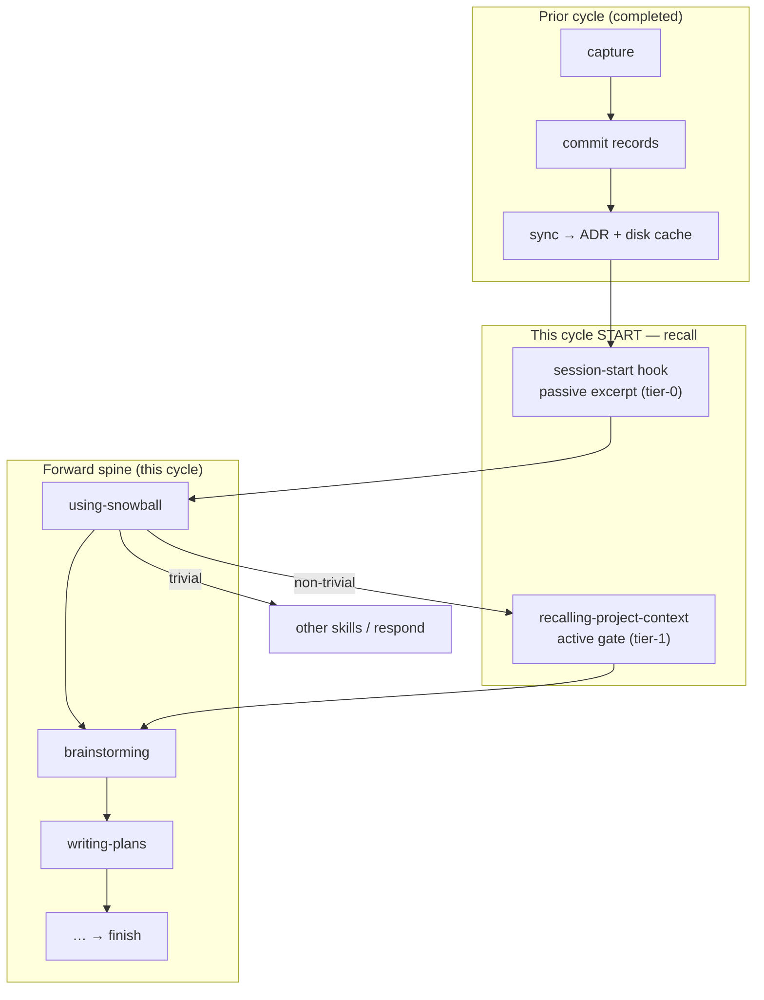
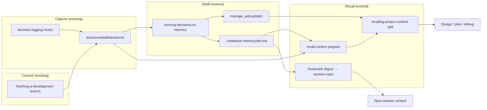

# Recalling Project Context — Closing the Decision-Spine Recall Loop

**Date:** 2026-06-07
**Status:** Draft
**Scope:** `skills/recalling-project-context/`, targeted extensions to `skills/syncing-decisions-to-memory/`, cycle-start documentation in forward-spine skills, process docs
**Depends on (optional, external):** `codebase-memory` MCP (`list_projects`, `manage_adr`, optional graph tools)
**Approach:** B — spec + targeted loop closure (baseline audit against commit `8e224b5` spike)

## Problem

Snowball's decision spine is **capture → commit → distill → recall**. The distill (`syncing-decisions-to-memory`) and recall (`recalling-project-context`) skills were implemented in commit `8e224b5` without a design spec, implementation plan, or dogfood proof. The process documentation describes a closed loop, but:

1. There is no authoritative spec or plan for recall.
2. README still lists recall as **in progress**.
3. **Staleness detection** is documented in the recall skill procedure but not implemented in the `prepare` CLI.
4. **Session-start recall** (tier-0) reads `.codebase-memory/adr.md` from disk, but sync only writes via MCP — disk persistence is an implicit codebase-memory side effect, not a snowball contract.
5. Recall's role at the **start of a snowball cycle** is implied by wiring but not stated explicitly in skill or process docs.

Without closing these gaps, cross-session dogfooding (the B-bar) is hope-based: the next session may not inject rationale even after a successful sync.

## Goals

1. Authoritative **design spec** with explicit **delta-from-shipped** audit (keep / change / add against `8e224b5`).
2. **Targeted code changes** so cross-session recall is snowball-owned and testable (Approach B).
3. **Full snowball loop on this feature:** brainstorm → spec → plan → implement → dogfood.
4. Make **cycle-start recall** explicit: recall closes the decision spine and **opens** the forward spine for non-trivial work.
5. **Dogfood success (B-bar):** this session's design MADRs committed with the spec; sync updates ADR digest; **next session** session-start injects rationale from this work.

## Non-Goals

- Extracting a shared `decision-spine` package (defer; recall currently imports sync `src/` — document coupling, refactor later).
- Auto-running sync when recall detects staleness (sync stays on-demand; offered at finish).
- Committing `.codebase-memory/` to git (stays gitignored; per-machine read-through cache).
- Proving every forward-spine call site in a second real task (B-bar covers cross-session hook injection only).
- Changing decision-logging hooks or blast-radius.

## Architecture

### Recall opens the cycle

A snowball **cycle** is one pass from intent → integrated work → decision trail committed/distilled. Recall is the **handoff from the prior cycle into this one**:



**Two-tier cycle-start recall:**

| Tier | Mechanism | When | Authority |
|------|-----------|------|-----------|
| **0 — Passive** | `hooks/adr-digest` → `session-start` | Every session, before agent reads user message | Injects capped `<project-memory>`; no MCP, no LLM |
| **1 — Active gate** | `recalling-project-context` skill | First non-trivial task in a cycle — **before** brainstorming, plan mode, or design work | Live MCP + scoped MADRs + staleness; ≤10 bullet synthesis |

**Forward-spine placement:**

1. Bootstrap injects `using-snowball` + tier-0 excerpt.
2. User message → `using-snowball`: non-trivial → tier-1 recall → then skill check / brainstorming.
3. `brainstorming` step 1 re-invokes recall (scoped) — ensures design never starts cold when scope differs or tier-1 was skipped on a prior turn.

Recall is the **first intentional gate on non-trivial work** and the bridge that makes the decision spine readable at cycle start.

### End-to-end loop



**New snowball-owned contract:** after successful `manage_adr(update)`, sync also writes the rendered ADR to `.codebase-memory/adr.md`. Tier-0 no longer depends on codebase-memory's side-effect disk write.

### Pure / impure boundary

| Layer | Owner | Responsibility |
|-------|-------|------------------|
| **Pure core** | `recall-context.cjs`, `sync-decisions.cjs` | gather, filter, digest, ADR parse/excerpt, staleness, `writeDiskCache` |
| **Impure shell** | `SKILL.md` agents | MCP, synthesis bullets, optional graph queries |
| **Passive hook** | `hooks/adr-digest` | `excerpt` subcommand only |

Recall reuses sync's `gather`, `filter`, and `computeDigest` via direct `src/` imports (shipped spike). Documented coupling; shared package deferred.

## Delta-from-shipped audit (commit `8e224b5`)

| Artifact | Verdict | Notes |
|----------|---------|-------|
| `skills/recalling-project-context/SKILL.md` | **Change** | Cycle-start framing; staleness via `prepare.staleness` |
| `src/recall-context.ts`, `recall-madrs.ts`, `adr-excerpt.ts` | **Keep**, extend | Staleness fields; excerpt lines |
| `scripts/recall-context.cjs` | **Keep** (rebuilt) | — |
| `hooks/adr-digest`, `hooks/session-start` | **Keep** | Benefit from disk cache + staleness in excerpt |
| Forward-spine refs (`brainstorming`, `using-snowball`, `writing-plans`, `systematic-debugging`) | **Keep**, doc clarify | Cycle-start role explicit in using-snowball + brainstorming |
| `tests/recalling-project-context/` | **Keep**, extend | Staleness + cross-skill contract test |
| `skills/syncing-decisions-to-memory/SKILL.md` | **Change** | Disk cache step after MCP update |
| `sync-decisions.ts` | **Add** | `writeDiskCache(gitRoot, content)` |
| `tests/syncing-decisions-to-memory/` | **Add** | Disk write unit test |
| Staleness in recall `prepare` | **Add** | `adrDigest` vs `currentDigest` |
| `docs/design/snowball-process.md` | **Change** | Recall feeds into forward spine cycle start |
| Design spec + plan | **Add** | This file + implementation plan |
| README "in progress" | **Change** | Shipped after dogfood B passes |
| Shared `decision-spine` package | **Defer** | Future work |

## Data flow

### Tier-0: session start

```text
session-start → adr-digest → node recall-context.cjs excerpt < {gitRoot}
  → prepare() → renderExcerptForHook() → inject <project-memory>…
```

Exits 0 silently when no ADR and no MADRs. No MCP.

### Tier-1: cycle-start recall (skill)

1. `git rev-parse --show-toplevel`
2. Optional scope from task
3. `node recall-context.cjs prepare < {gitRoot, scope?}` → read JSON including `staleness`
4. MCP: `list_projects` → `manage_adr(get)` when available; prefer live over disk sections
5. Optional: `search_graph` or `detect_changes` (1–2 queries)
6. Synthesize ≤10 bullets; report before continuing forward spine

When live MCP ADR is available, agent compares live digest vs `prepare.currentDigest` for staleness (same semantics as disk path).

### Distill → disk cache (sync extension)

After successful `manage_adr(update)`:

```text
writeDiskCache(gitRoot, renderedContent)
  → mkdir .codebase-memory/ if needed
  → atomic write adr.md
```

Write only after MCP success. No write on noop or MCP failure.

### Staleness model

`prepare` output additions:

```typescript
{
  adrDigest: string | null;
  currentDigest: string | null;
  staleness: "current" | "stale" | "unknown";
}
```

| `staleness` | Meaning | Tier-0 excerpt | Tier-1 agent |
|-------------|---------|----------------|--------------|
| `current` | ADR digest matches filtered decisions | `ADR is current (digest: …)` | omit or one-line OK |
| `stale` | Decisions changed since last sync | `ADR may be stale — run syncing-decisions-to-memory` | note sync may be due |
| `unknown` | No ADR / no digest marker | existing madrs-only messaging | MADRs primary |

## Error handling

| Situation | Behavior |
|-----------|----------|
| Not a git repo | Skill stops step 1; hook exits 0 |
| No ADR, no MADRs | `source: "empty"`; continue |
| Malformed MADR / JSONL | Skip; `warnings`; never abort |
| MCP unreachable / not indexed | Disk + MADRs fallback; do not block |
| `writeDiskCache` fails | Warn; MCP write succeeded — tier-0 may miss until next sync on machine |
| Hook / node error | Hook exits 0 silently (existing) |

Staleness surfaces only; sync is never auto-invoked from recall.

## Testing

**Unit — recall:** staleness states; excerpt lines per state; existing tests unchanged.

**Unit — sync:** `writeDiskCache` creates/overwrites file.

**Contract (fast suite, no MCP):**

```text
renderAdr(fixture) → writeDiskCache(repo, doc)
  → renderExcerptForHook({gitRoot: repo})
  → assert sections + digest present
```

**Not tested:** agent synthesis, MCP orchestration, bash hook (manual dogfood step 6).

## Dogfood protocol (B-bar)

| Step | Action | Pass criterion |
|------|--------|----------------|
| 1 | Invoke recall scoped to this feature during design | Bullets reference prior PHILOSOPHY |
| 2 | Commit spec with this brainstorm's MADRs | Records beside spec on branch |
| 3 | Implement per plan | Unit + contract tests green |
| 4 | `finishing-a-development-branch` preserve path | `commit-decision-records` runs |
| 5 | Accept ADR sync offer | MCP updated; `.codebase-memory/adr.md` written; digest changes |
| 6 | **Cross-session:** new session, same repo | Session-start `<project-memory>` includes recall-loop rationale |
| 7 | Update README | Recall moved from "in progress" to shipped |

Step 6: manual operator confirmation — acceptance gate for B.

## Future work

- Shared `decision-spine` package extracting gather/filter/digest/ADR parse (Approach C).
- Tier-1 recall idempotency marker per session (skip re-recall on same cycle) — only if nag-fatigue observed.

## References

- `skills/recalling-project-context/SKILL.md` — shipped spike
- `docs/snowball/specs/2026-05-31-syncing-decisions-to-codebase-memory-design.md` — distill skill
- `docs/snowball/specs/2026-05-31-completion-flow-decision-trail-design.md` — commit + sync offer
- `docs/design/snowball-process.md` — two-spine model
