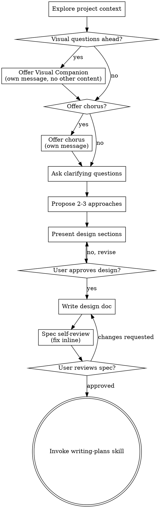

# Brainstorming Ideas Into Designs

Help turn ideas into fully formed designs and specs through natural collaborative dialogue.

Start by understanding the current project context, then ask questions one at a time to refine the idea. Once you understand what you're building, present the design and get user approval.

<HARD-GATE>
Do NOT invoke any implementation skill, write any code, scaffold any project, or take any implementation action until you have presented a design and the user has approved it. This applies to EVERY project regardless of perceived simplicity.
</HARD-GATE>

## Anti-Pattern: "This Is Too Simple To Need A Design"

Every project goes through this process. A todo list, a single-function utility, a config change — all of them. "Simple" projects are where unexamined assumptions cause the most wasted work. The design can be short (a few sentences for truly simple projects), but you MUST present it and get approval.

## Checklist

You MUST create a task for each of these items and complete them in order:

1. **Explore project context** — when the task is non-trivial, invoke `snowball:recalling-project-context` first (if installed) to recover **prior-cycle rationale** before exploring this cycle's design; then check files, docs, recent commits
2. **Offer visual companion** (if topic will involve visual questions) — this is its own message, not combined with a clarifying question. See the Visual Companion section below.
3. **Offer chorus companion** (if the `chorus:chorus` skill is available and the topic may involve cross-cutting trade-offs) — its own message, like the visual companion offer. See the Chorus Companion section below.
4. **Ask clarifying questions** — one at a time, understand purpose/constraints/success criteria
5. **Propose 2-3 approaches** — with trade-offs and your recommendation; once alternatives are stable, invoke `snowball:blast-radius` with the `design` preset and attach per-approach scope/impact estimates (see Blast-Radius at design-time below)
6. **Present design** — in sections scaled to their complexity, get user approval after each section
7. **Write design doc** — save to `docs/snowball/specs/YYYY-MM-DD-<topic>-design.md` and commit
8. **Spec self-review** — quick inline check for placeholders, contradictions, ambiguity, scope (see below)
9. **User reviews written spec** — ask user to review the spec file before proceeding
10. **Transition to implementation** — invoke writing-plans skill to create implementation plan

## Process Flow

**The terminal state is invoking writing-plans.** Do NOT invoke frontend-design, mcp-builder, or any other implementation skill. The ONLY skill you invoke after brainstorming is writing-plans.

## The Process

**Understanding the idea:**

- For non-trivial work, invoke `snowball:recalling-project-context` (when installed) before deep exploration — it surfaces prior-cycle ADR TRADEOFFS/PHILOSOPHY and scoped MADRs from prior sessions
- Check out the current project state (files, docs, recent commits)
- Before asking detailed questions, assess scope: if the request describes multiple independent subsystems (e.g., "build a platform with chat, file storage, billing, and analytics"), flag this immediately. Don't spend questions refining details of a project that needs to be decomposed first.
- If the project is too large for a single spec, help the user decompose into sub-projects: what are the independent pieces, how do they relate, what order should they be built? Then brainstorm the first sub-project through the normal design flow. Each sub-project gets its own spec → plan → implementation cycle.
- For appropriately-scoped projects, ask questions one at a time to refine the idea
- Prefer multiple choice questions when possible, but open-ended is fine too
- Only one question per message - if a topic needs more exploration, break it into multiple questions
- Focus on understanding: purpose, constraints, success criteria

**Exploring approaches:**

- Propose 2-3 different approaches with trade-offs
- Present options conversationally with your recommendation and reasoning
- Lead with your recommended option and explain why
- **OPTIONAL SUB-SKILL:** Once the alternatives are stable and their pros/cons cross-cut (the same consideration applies to multiple options, no single option clearly wins), use `snowball:structured-argumentation` to externalize the option/trade-off graph as a sibling `.argdown` file next to the spec. The graph surfaces the structure of the reasoning you've already done in prose — it does not replace prose deliberation. Skip for simple either/or choices.
- **OPTIONAL SUB-SKILL (multi-model perspective):** At the same decision point, if the chorus companion was offered and accepted this session, you may delegate to `chorus:chorus` for a multi-model debate on the stable alternatives. See the Chorus Companion section below. Complementary to structured-argumentation: argdown structures your own reasoning, chorus brings several models' (and an optional Argdown critic's).
- **OPTIONAL SUB-SKILL (scope sizing):** At the same decision point, invoke `snowball:blast-radius` with preset `design`. For each approach, pass projected `changeSet.paths` to `compute-and-persist`, render, and attach the scope/impact summary to the approach presentation. Report-only at this gate — it right-sizes the decision before the user picks. Skip for trivial brainstorms (same self-gating as the blast-radius skill). If the operator skips, use `explicitSkip: true`.

**Presenting the design:**

- Once you believe you understand what you're building, present the design
- Scale each section to its complexity: a few sentences if straightforward, up to 200-300 words if nuanced
- Ask after each section whether it looks right so far
- Cover: architecture, components, data flow, error handling, testing
- Be ready to go back and clarify if something doesn't make sense

**Design for isolation and clarity:**

- Break the system into smaller units that each have one clear purpose, communicate through well-defined interfaces, and can be understood and tested independently
- For each unit, you should be able to answer: what does it do, how do you use it, and what does it depend on?
- Can someone understand what a unit does without reading its internals? Can you change the internals without breaking consumers? If not, the boundaries need work.
- Smaller, well-bounded units are also easier for you to work with - you reason better about code you can hold in context at once, and your edits are more reliable when files are focused. When a file grows large, that's often a signal that it's doing too much.

**Working in existing codebases:**

- Explore the current structure before proposing changes. Follow existing patterns.
- Where existing code has problems that affect the work (e.g., a file that's grown too large, unclear boundaries, tangled responsibilities), include targeted improvements as part of the design - the way a good developer improves code they're working in.
- Don't propose unrelated refactoring. Stay focused on what serves the current goal.

## After the Design

**Documentation:**

- Write the validated design (spec) to `docs/snowball/specs/YYYY-MM-DD-<topic>-design.md`
  - (User preferences for spec location override this default)
- Use elements-of-style:writing-clearly-and-concisely skill if available
- Commit the design document to git

**Spec Self-Review:**
After writing the spec document, look at it with fresh eyes:

1. **Placeholder scan:** Any "TBD", "TODO", incomplete sections, or vague requirements? Fix them.
2. **Internal consistency:** Do any sections contradict each other? Does the architecture match the feature descriptions?
3. **Scope check:** Is this focused enough for a single implementation plan, or does it need decomposition?
4. **Ambiguity check:** Could any requirement be interpreted two different ways? If so, pick one and make it explicit.

Fix any issues inline. No need to re-review — just fix and move on.

**User Review Gate:**
After the spec review loop passes, ask the user to review the written spec before proceeding:

> "Spec written and committed to `<path>`. Please review it and let me know if you want to make any changes before we start writing out the implementation plan."

Wait for the user's response. If they request changes, make them and re-run the spec review loop. Only proceed once the user approves.

**Implementation:**

- Invoke the writing-plans skill to create a detailed implementation plan
- Do NOT invoke any other skill. writing-plans is the next step.

## Key Principles

- **One question at a time** - Don't overwhelm with multiple questions
- **Multiple choice preferred** - Easier to answer than open-ended when possible
- **YAGNI ruthlessly** - Remove unnecessary features from all designs
- **Explore alternatives** - Always propose 2-3 approaches before settling
- **Incremental validation** - Present design, get approval before moving on
- **Be flexible** - Go back and clarify when something doesn't make sense

## Visual Companion

A browser-based companion for showing mockups, diagrams, and visual options during brainstorming. Available as a tool — not a mode. Accepting the companion means it's available for questions that benefit from visual treatment; it does NOT mean every question goes through the browser.

**Offering the companion:** When you anticipate that upcoming questions will involve visual content (mockups, layouts, diagrams), offer it once for consent:
> "Some of what we're working on might be easier to explain if I can show it to you in a web browser. I can put together mockups, diagrams, comparisons, and other visuals as we go. This feature is still new and can be token-intensive. Want to try it? (Requires opening a local URL)"

**This offer MUST be its own message.** Do not combine it with clarifying questions, context summaries, or any other content. The message should contain ONLY the offer above and nothing else. Wait for the user's response before continuing. If they decline, proceed with text-only brainstorming.

**Per-question decision:** Even after the user accepts, decide FOR EACH QUESTION whether to use the browser or the terminal. The test: **would the user understand this better by seeing it than reading it?**

- **Use the browser** for content that IS visual — mockups, wireframes, layout comparisons, architecture diagrams, side-by-side visual designs
- **Use the terminal** for content that is text — requirements questions, conceptual choices, tradeoff lists, A/B/C/D text options, scope decisions

A question about a UI topic is not automatically a visual question. "What does personality mean in this context?" is a conceptual question — use the terminal. "Which wizard layout works better?" is a visual question — use the browser.

If they agree to the companion, read the detailed guide before proceeding:
`skills/brainstorming/visual-companion.md`

## Chorus Companion

A multi-model brainstorming partner: the `chorus:chorus` skill runs an N-participant round-robin dialogue across several AI models (anthropic/openai/gemini/minimax), with an optional Argdown critic that surfaces which arguments survive. It often finds angles a single model misses. Available as an optional tool when the skill is installed — not a mode. Accepting the offer means it's *available* for hard decisions; it does NOT route every decision through chorus.

**Detecting availability:** Before offering, check whether the `chorus:chorus` skill is available to you — it appears in your list of available skills. If it isn't listed, say nothing and proceed with normal brainstorming. The offer never appears when chorus isn't installed. No binary check is needed: chorus owns its CLI and handles missing API keys or runtime errors itself.

**Offering the companion:** When chorus is available AND the brainstorm is substantive enough that cross-cutting trade-offs are plausible, offer it once — the same topic-conditional spirit as the Visual Companion. Skip the offer for trivially-simple brainstorms where no real alternatives will arise; chorus being installed is necessary but not sufficient.

> "I can bring in chorus as a multi-model brainstorming partner. When we hit a genuinely cross-cutting trade-off, it runs a few rounds of round-robin debate across several AI models — with an optional critic that surfaces which arguments survive — and often finds angles I'd miss alone. It's token-intensive and needs API keys for the models in the cast (the default cast uses MiniMax). Want it available for this session? I'll only reach for it on hard, cross-cutting calls — not every question."

**This offer MUST be its own message.** Do not combine it with clarifying questions, context summaries, or any other content. When both companions apply, make the Visual Companion offer first, then this one — each its own standalone message — before clarifying questions begin. If the user declines, proceed with normal brainstorming.

**When to reach for it:** Only at the "Propose 2-3 approaches" step, once alternatives are stable and their pros/cons cross-cut (the same condition that gates the `snowball:structured-argumentation` sub-skill). Not for from-scratch ideation — that's what the rest of this skill is for, and it's exactly what chorus's own guidance defers back here.

**How to run it — delegate, then reclaim control:** Invoke `chorus:chorus` via the Skill tool, framed as *a multi-model debate on these specific, already-stable alternatives*. That framing matches chorus's valid-use criteria (a cross-cutting trade-off several models argue out) and sidesteps its "not for open-ended ideation" guard. Chorus runs the dialogue and writes a transcript; when it returns, read the surviving arguments and the synthesized angles, hand them back to brainstorming, and continue presenting approaches. Brainstorming stays the driver; chorus is a sub-routine that returns angles. If chorus fails (missing API key, CLI error), note it and continue text-only — it never blocks design progress.

**Relationship to structured-argumentation:** Complementary, can chain. Argdown externalizes the structure of *your own* reasoning; chorus injects *several models'* reasoning (and its own Argdown critic already structures the debate). A natural combination: chorus to surface angles, then argdown to structure the resulting option/trade-off graph.

## Blast-Radius at design-time

After alternatives are stable and before the user picks one:

1. Invoke `snowball:blast-radius` once per approach (or once for the recommended approach if the others are clearly smaller — use judgment, but never skip for non-trivial cross-cutting work).
2. Pass projected paths the approach would touch as `changeSet.paths`.
3. Surface the rendered report under each approach heading. With `SNOWBALL_BLAST_RADIUS_GRAPH_BACKEND` defaulting to `yactt` (per `2026-07-10-yactt-graph-backend-design.md`), expect `backend: graph` (the envelope's closed enum is unchanged) when the repo is yactt-loaded; otherwise expect `backend: heuristic` with an honest reason. The `backend_attempts` array on the envelope records which graph backends were attempted before the heuristic floor fired (e.g. `["yactt", "codebase-memory"]`).
4. If the decomposition flag appears, call it out explicitly when making your recommendation.

This is **report-only** at design-time — it does not block brainstorming.
